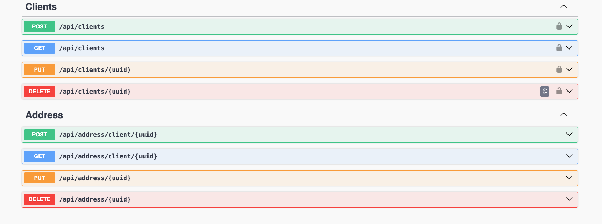

<p align="center">
  <a href="http://nestjs.com/" target="blank"></a>
</p>


### Endpoints (Documentation)

```bash
/api/docs
```


## Description

Api de  desarrollado con el siguiente Stack:

- PostgresDB
- NestJS

```bash
Node v18.14.2
Postgres v16
Nest v10.3.2
```

### Ejecutar en local

```bash
yarn; yarn start:local
```


Estructura del Módulo

```bash
src/
├── [nombre-del-modulo]/
│   ├── controllers/         # Controladores para manejar las solicitudes HTTP
│   ├── dto/                 # Data Transfer Objects para validaciones y transformación de datos
│   ├── entities/            # Entidades que representan las tablas de la base de datos
│   ├── repositories/        # Repositorios para acceso a datos
│   ├── services/            # Servicios con la lógica de negocio
│   ├── mapper/              # (Opcional) Transformadores entre entidades y DTOs
│   └── [nombre-del-modulo].module.ts # Configuración del módulo
```

